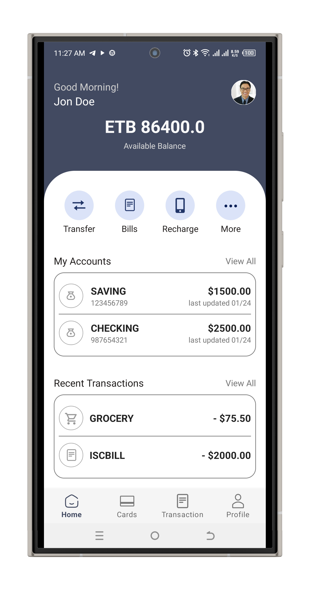
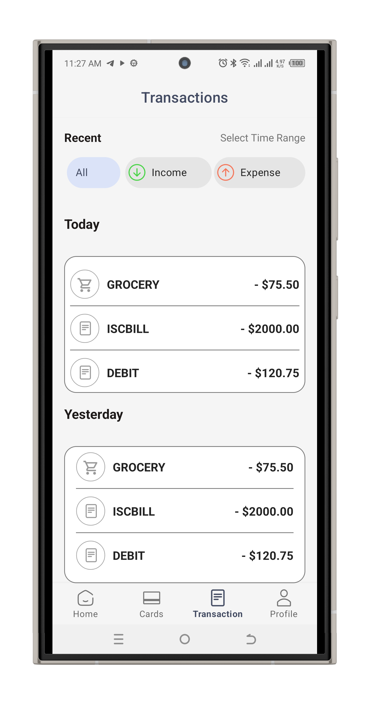

# Banking App - Kotlin Version

## Overview
This repository contains the Kotlin (Native Android) implementation for the Mobile Developer Challenge: Banking App User Interface. The app provides an intuitive user interface for core banking operations, interacting with a provided backend API (or mocked where necessary). This version focuses primarily on the UI components and layout, with partial API integration for demonstration purposes. For a fully functional cross-platform version, check out the Flutter counterpart.


> ⚠️ **Note:** This Kotlin version of the Banking App is still a work-in-progress.  
> the Ui mostly done as per the Figma design. and the network module with dependency injection is also done.
> All necessary views are not yet integrated with API data  
> The full version will be completed by Monday.


## Screenshots

| Login Screen | Dashboard | Transaction History |
|--------------|-----------|-------------------|
|  |  |  |


The app demonstrates:

- User authentication (login and registration screens)
- Dashboard for account overview
- Fund transfer interface
- Transaction history view
- Basic error handling and loading states

It follows the provided Figma UI design and integrates with the challenge API at [https://challenge-api.qena.dev](https://challenge-api.qena.dev).

---

## Tech Stack

**Language:** Kotlin  
**Platform:** Native Android  
**Build System:** Gradle (KTS)

**Key Libraries:**

- **Android Jetpack:** Core KTX, AppCompat, ConstraintLayout, Lifecycle (LiveData & ViewModel), Navigation, Fragment KTX
- **Dependency Injection:** Hilt
- **Networking:** Retrofit, OkHttp, Moshi (for JSON parsing)
- **Coroutines:** Kotlinx Coroutines (for async operations)
- **Security:** AndroidX Security Crypto (for secure token storage)
- **UI:** Material Design, View Binding

**Compile SDK:** 36  
**Min SDK:** 24  
**Target SDK:** 36  
**JVM Target:** 11

---

## Features

### User Authentication
- Login screen with username and password inputs.
- Registration screen with fields for username, password, first name, last name, email, and phone number.
- Secure storage of JWT access and refresh tokens using EncryptedSharedPreferences.
- Automatic token refresh logic on 401 errors.

### Dashboard / Account Overview
- Displays user's bank accounts with account number, type, and balance.
- Navigation to create account, transfer funds, and view transactions.
- Supports pagination for account listing.

### Fund Transfer
- Form for peer-to-peer transfers.
- Dropdown for selecting from user's accounts.
- Inputs for recipient account number and amount.
- Client-side validation and error handling (e.g., insufficient funds).

### Transaction History
- Paginated list of transactions for a selected account.
- Shows amount, type, direction (DEBIT/CREDIT), timestamp, and description.
- "Load More" functionality for pagination.

### UX Enhancements
- Loading indicators during API calls.
- User-friendly error messages.
- Responsive design for various screen sizes and orientations.
- Basic input validation.

> **Note:** This version emphasizes UI/UX fidelity to the Figma design. Full API integration (e.g., real-time data fetching and error responses) is partially implemented for demo purposes. Network calls use Retrofit with Coroutines for asynchronous handling.

---

## Setup and Installation

### Prerequisites
- Android Studio (latest stable version recommended)
- JDK 11 or higher
- Android SDK with API level 36 installed
- An emulator or physical device running Android 7.0 (API 24) or higher

### Steps to Run

#### Clone the Repository
```bash
git@github.com:Asrat001/banking_app_kotlin_with_view.git
